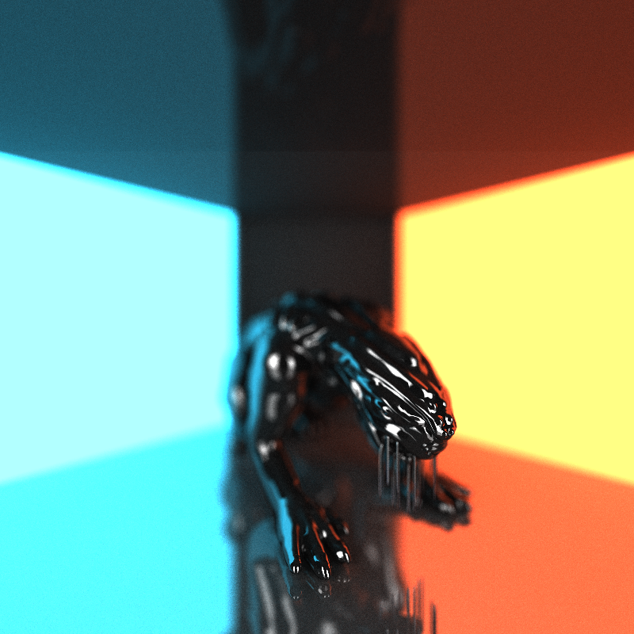

# CUDA Path Tracer

---
* Hi! I am Vismay Churiwala, here are my socials:  
  * [LinkedIn](https://www.linkedin.com/in/vismay-churiwala-8b0073190/) | [Website](https://vismaychuriwala.com/)
* **System Specs (My Machine):**  
  * OS: Windows 11
  * CPU: AMD Ryzen 7 5800H with Radeon Graphics (8C/16T, 3.2GHz base)
  * RAM: 32GB DDR4
  * GPU: NVIDIA GeForce RTX 3060 Laptop GPU (6GB GDDR6)
  * CUDA Toolkit: 13.0
  * Driver Version: 581.15

---
This is a Path Tracer written in CUDA. A path tracer is an image renderer that simulates realistic lighting of a scene by tracing the path of rays emitted by light sources, including the light bouncing off objects or passing through them. This operation is highly parallelizable since the rays essentially do not interact with each others, so the path of each ray and its influence can be determined in parallel. This is where CUDA shines, and we can use this parallelism to render scenes in a reasonable amount of time.

Here are some cool features I have implemented:
* A **parallel intersection kernel** that takes advantage of CUDA to compute intersections much faster.
* A shading kernel with **BSDF evaluation** for **diffuse**, **specular** and **refractive** surfaces.
* Support for making `rays`/`pathSegments`/`intersections` **contiguous in memory** by using parallel sort.
* **Stream compaction** for culling terminated rays.
* **Stochastic Sampled Anti-Aliasing** by jittering ray directions stachastically.
* **Depth-of-Field** lens effect with configurable depth-of-field and lens radius.
* OBJ **Mesh loading and rendering** with support for material files.
* **Triangle Intersection test** using the Möller–Trumbore algorithm.

