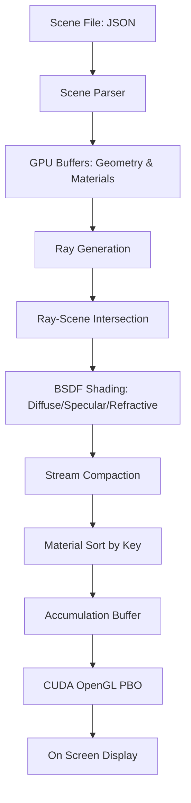
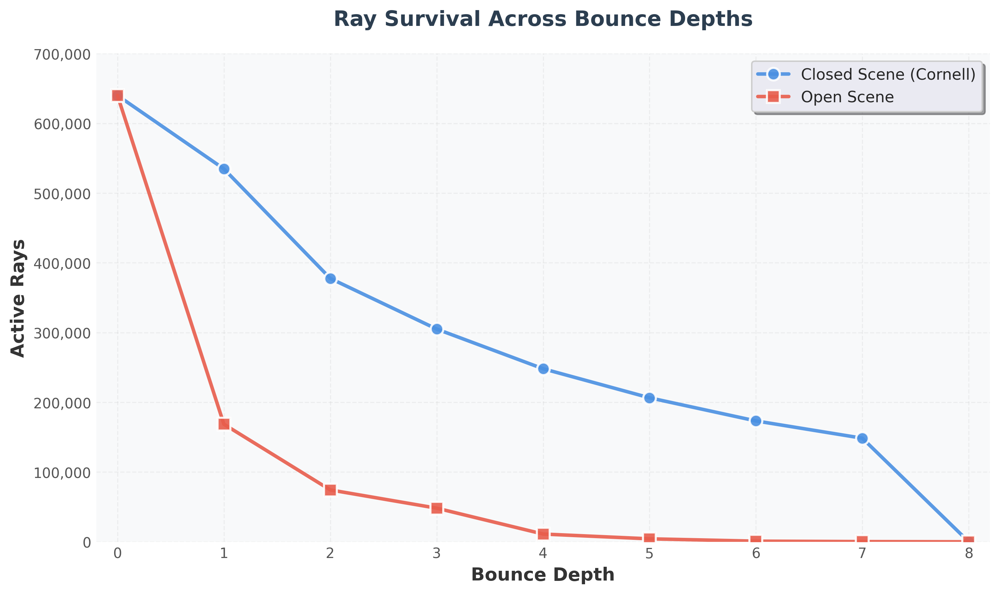
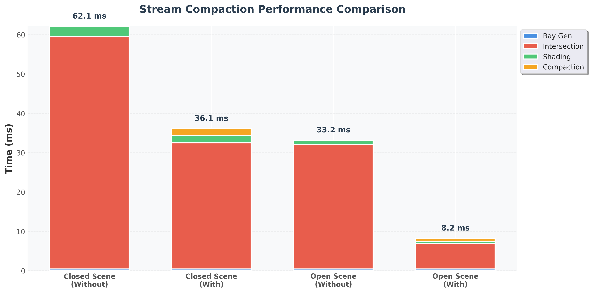
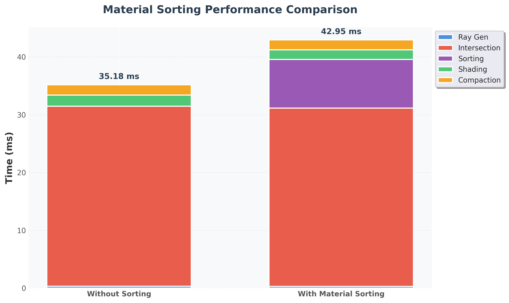
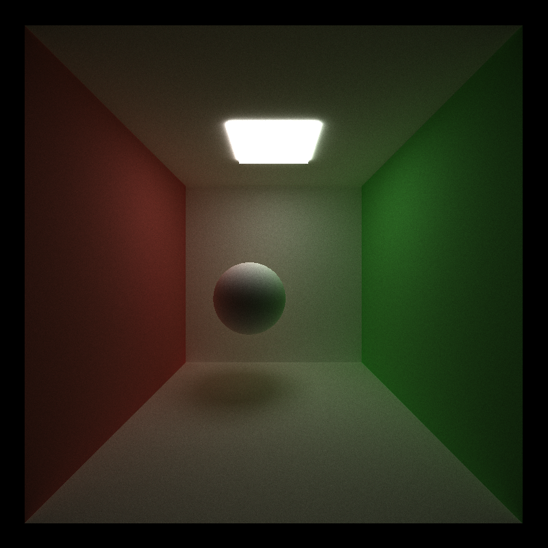
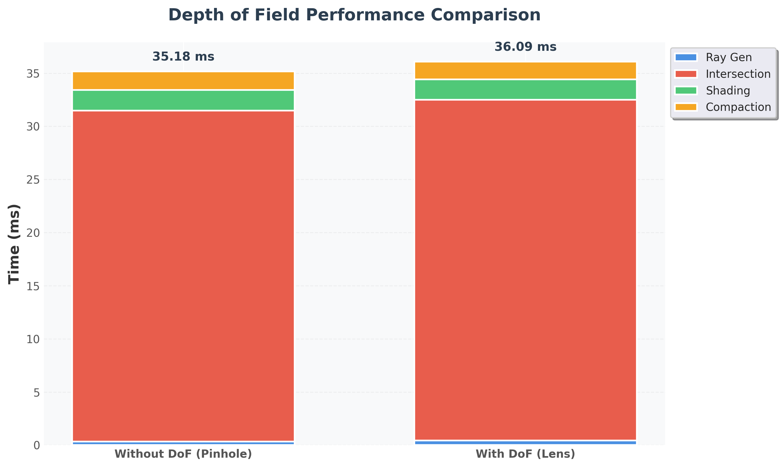
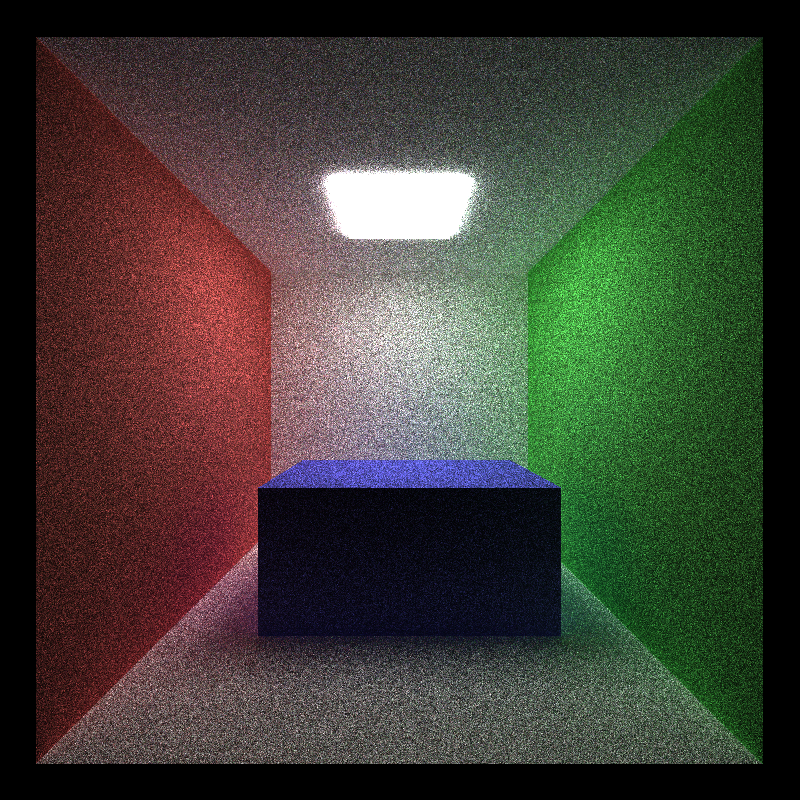
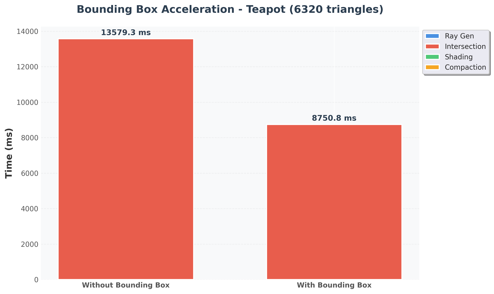
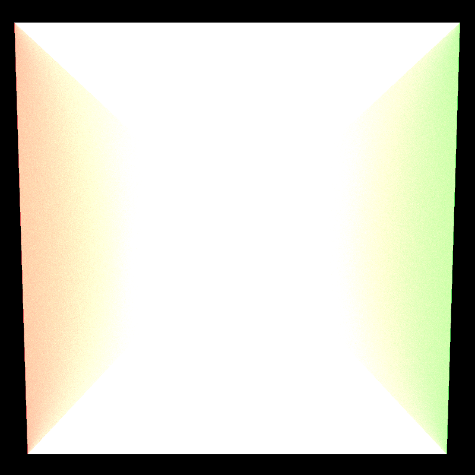
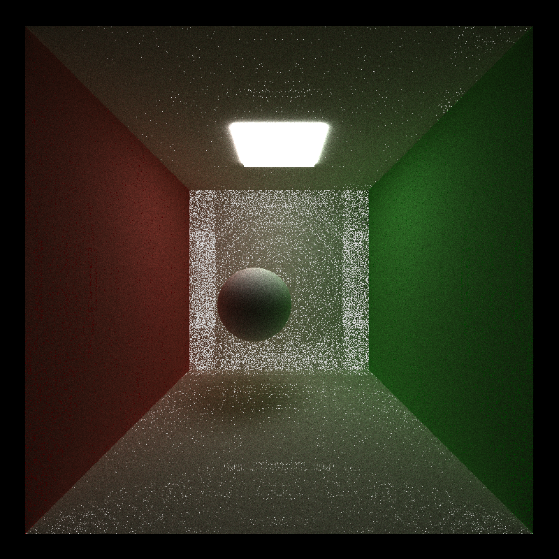

# CUDA Path Tracer

*Alien creature — 1200×1200, 5000 samples, depth 12, rendered in ~1m 50s*

---
* Hi! I am Vismay Churiwala, here are my socials:
  * [LinkedIn](https://www.linkedin.com/in/vismay-churiwala-8b0073190/) | [Website](https://vismaychuriwala.com/)
* **System Specs (My Machine):**
  * OS: Windows 11
  * CPU: AMD Ryzen 7 5800H with Radeon Graphics (8C/16T, 3.2GHz base)
  * RAM: 32GB DDR4
  * GPU: NVIDIA GeForce RTX 3060 Laptop GPU (6GB GDDR6)
  * CUDA Toolkit: 13.0
  * Driver Version: 581.15

---

## Table of Contents

- [Overview](#overview)
- [System Architecture](#system-architecture)
- [Features](#features)
  - [BSDF Shading](#bsdf-shading)
  - [Stream Compaction](#stream-compaction)
  - [Material Sorting](#material-sorting)
  - [Anti-Aliasing](#anti-aliasing)
  - [Depth of Field](#depth-of-field)
  - [Mesh Loading & Triangle Intersection](#mesh-loading--triangle-intersection)
  - [BVH Acceleration Structure](#bvh-acceleration-structure)
- [Performance Testing](#performance-testing)
- [Future Improvements](#future-improvements)
- [Bloopers](#bloopers)
- [References](#references)

---

## Overview

This is a Path Tracer written in CUDA. A path tracer is an image renderer that simulates realistic lighting of a scene by tracing the path of rays emitted by light sources, including the light bouncing off objects or passing through them. This operation is highly parallelizable since the rays essentially do not interact with each others, so the path of each ray and its influence can be determined in parallel. This is where CUDA shines, and we can use this parallelism to render scenes in a reasonable amount of time.

## System Architecture



## Features

### BSDF Shading

The path tracer supports multiple material types with physically-based BSDF evaluation.

| Diffuse | Specular | Refractive |
| --- | --- | --- |
|  |  |  |

#### Implementation

Three material types are implemented:

**Diffuse**: Implements Lambertian reflection using cosine-weighted hemisphere sampling. Two random samples generate a point on the hemisphere weighted towards the normal. The BSDF PDF is computed as `cos(θ) / π` where θ is the angle between the normal and outgoing direction.

**Specular**: Perfect mirror reflection calculated by reflecting the incoming ray direction about the surface normal. No randomness involved - each ray produces a deterministic reflection.

**Refractive**: Simulates glass-like materials with both reflection and refraction. Uses Snell's law to compute refraction angles and Schlick's approximation for Fresnel effects. The material can have colored tint applied to transmitted light.

The shading kernel evaluates the BSDF, scatters rays, and accumulates color along the path until rays hit a light source or terminate.

#### Performance

For the Cornell box scene, the diffuse BSDF adds roughly **8.3%** overhead compared to a baseline "fake" shader that terminates immediately (**32.5 ms/frame** vs **35.2 ms/frame**). The overhead comes from hemisphere sampling, constructing local coordinate frames, evaluating the BSDF PDF, and continuing paths through multiple bounces.

The cost is reasonable given that the diffuse shader implements actual light transport while the fake shader just approximates surface appearance in a single pass.

#### GPU vs CPU

Diffuse sampling is perfectly suited for GPU execution. Every ray undergoes identical sampling operations with no branching, resulting in complete coherence across warps. CPU implementations would be slower due to sequential processing.

#### Further Optimizations

Importance sampling could account for color variation across surfaces to reduce variance in the Monte Carlo integration.

<br>

### Stream Compaction

Stream compaction removes terminated rays from the active ray pool, reducing the number of rays processed in subsequent bounces.

#### Implementation

Uses Thrust's `remove_if` to compact the path array in-place. Rays with `remainingBounces == 0` are culled after each shading pass. The implementation:
1. Evaluates a predicate (ray is dead) for each path segment
2. Removes dead paths and compacts the array
3. Returns the new count of active rays

This uses Thrust's optimized GPU scan-based compaction. **Note**: A [custom implementation with shared memory optimization and bank conflict avoidance](https://github.com/vismaychuriwala/CUDA-Stream-Compaction) can be significantly faster than Thrust's version, and I plan to replace this with that custom implementation in the future.

#### Performance

The graph below shows how the number of active rays evolves with bounce depth in open and closed scenes.



In the **open scene**, the ray count decreases rapidly from **640,000** to **284** rays by bounce 7 (99.96% reduction). This happens because rays miss geometry or terminate when hitting light emitters.

In the **closed scene** (Cornell box), rays persist across more bounces since they keep bouncing off walls. Ray count decreases from **640,000** to **148,540** by bounce 7 (76.8% reduction), limiting the relative benefit of compaction.

The graph below shows execution time of individual kernels with and without compaction for both closed and open scenes.



**Closed Scene (Cornell box)**:
- Without compaction: **62.1 ms** - processes all 640,000 rays through all 8 bounces
- With compaction: **36.1 ms** - removes terminated rays each bounce
- **Speedup: 41.9%** - significant benefit despite compaction overhead (~1.7 ms/bounce)

**Open Scene**:
- Without compaction: **33.2 ms** - processes all 640,000 rays through all 8 bounces
- With compaction: **8.2 ms** - rapidly culls rays that miss geometry
- **Speedup: 75.3%** - dramatic benefit as ray count drops to 284 by bounce 7

Stream compaction provides substantial performance gains, especially in open scenes where rays terminate quickly. The ~0.7-1.7 ms compaction overhead per bounce is easily offset by reduced intersection and shading costs.

#### GPU vs CPU

Parallel scan and scattering operations are well-suited for GPUs. Thrust's implementation is highly optimized. While modern CPUs can handle smaller arrays, GPUs have the advantage for large ray counts.

#### Further Optimizations

The current compaction happens every bounce. Adaptive compaction (only when ray count drops below a threshold) could reduce overhead.

<br>

### Material Sorting

Material sorting groups rays by material ID before shading to improve memory coherence and reduce warp divergence.

#### Implementation

Uses Thrust's `sort_by_key` to reorder rays based on material ID. The process:
1. Extract material IDs from intersections into a key array
2. Create an index array [0, 1, 2, ..., n-1]
3. Sort indices by material ID keys
4. Gather intersections and path segments into sorted order
5. Proceed with shading on sorted arrays

This ensures threads in a warp process the same material type, reducing divergence in the shading kernel. **Note**: A [custom radix sort implementation with shared memory optimization and bank conflict avoidance](https://github.com/vismaychuriwala/CUDA-Stream-Compaction) can be faster than Thrust's sort, and I plan to replace this in the future.

#### Performance

The graph below shows that sorting by material type increases shading coherence but introduces constant sorting overhead of roughly **8.4 ms** per bounce.

For the Cornell box scene, the additional cost outweighs divergence reduction. Sorting increased total frame time from **35.18 ms** to **42.95 ms** (**22.1%** slower), primarily due to sorting overhead.



#### GPU vs CPU

Sorting benefits from GPU parallelism. However, material sorting specifically addresses warp divergence, which is not a CPU concern. CPU path tracers wouldn't implement this optimization.

#### Further Optimizations

Material sorting becomes less necessary if the scene has uniform materials or if using a wavefront architecture that naturally groups by material.

<br>

### Anti-Aliasing

Stochastic anti-aliasing eliminates jagged edges by jittering ray origins within each pixel.

| Without Anti-Aliasing | With Anti-Aliasing |
| --- | --- |
|  |  |

#### Implementation

Each sample adds a random offset within the pixel's unit square before computing ray direction. The implementation uses a normal distribution (mean=0, σ=0.005) to generate jitter offsets, clamped to ±0.5 to stay within pixel bounds.

Can be toggled with `#define JITTER 1/0` in `pathtrace.cu`.

#### Performance

Anti-aliasing has minimal performance impact (**0.4%** overhead on total frame time) since jittering happens during ray generation, which is already memory-bound.

Ray generation time increases from **0.325 ms** to **0.426 ms** (31% increase due to additional RNG and clamping), but since ray generation represents less than 1% of total frame time, the overall impact is negligible. The dominant costs remain intersection (**~31 ms**) and shading (**~2 ms**).

Frame time: **35.18 ms** (without AA) vs **35.33 ms** (with AA).


#### GPU vs CPU

The random number generation for jitter is parallel and cheap on GPU. No divergence is introduced since all rays perform the same jitter computation. CPU implementations would see similar negligible overhead.

<br>

### Depth of Field

Simulates camera lens effects by jittering ray origins on a lens surface and focusing at a specified depth.


#### Implementation

Depth of field is simulated by modeling a thin lens:
1. Compute the focal point along the pinhole ray at distance `focalDistance`
2. Sample a point on the lens disk using concentric disk sampling (uniform distribution)
3. Offset the ray origin by the sampled lens position
4. Compute new ray direction from lens position to focal point

The lens radius controls blur amount. When `lensRadius = 0`, the camera acts as a pinhole (infinite depth of field).

#### Performance

Depth of field adds **2.6%** overhead compared to pinhole camera (**35.2 ms** vs **36.1 ms** per frame). The cost comes from additional random sampling (2 uniform samples per ray) and focal point computation.



Ray generation time increases from **0.325 ms** to **0.424 ms** (30% increase due to lens sampling), but since ray generation represents less than 1.5% of total frame time, the overall impact is minimal. The dominant costs remain intersection and shading.

#### GPU vs CPU

The additional arithmetic and sampling parallelize perfectly across rays. No divergence introduced. CPU would see similar small overhead.

<br>

### Mesh Loading & Triangle Intersection

Supports loading OBJ mesh files with triangle intersection using the Möller-Trumbore algorithm.

| Mesh Render | With Bounding Box Visualization |
| --- | --- |
|  |  |

#### Implementation

**Mesh Loading**: Uses [tinyobjloader](https://github.com/tinyobjloader/tinyobjloader) library to parse OBJ files and their associated MTL material definitions. Each triangle is stored as a `TRIANGLE` geometry primitive with vertex positions. The mesh is bounded by an axis-aligned bounding box (AABB). Material properties from MTL files are parsed and applied to the corresponding triangles.

**Triangle Intersection**: Implements the Möller-Trumbore algorithm:
1. Compute edge vectors and determinant
2. Check if ray is parallel to triangle (det ≈ 0)
3. Compute barycentric coordinates (u, v)
4. Validate triangle bounds: u ≥ 0, v ≥ 0, u+v ≤ 1
5. Compute intersection distance t

**Bounding Box Culling**: Before testing individual triangles, rays first test against the mesh's AABB. Triangles are only tested if the ray intersects the bounding box. This significantly reduces intersection tests for large meshes.

#### Performance

For the teapot mesh (**6320** triangles):

**Without bounding box**: Every ray tests against all **6320** triangles. Frame time: **13579.3 ms**.

**With bounding box**: Rays first test the AABB. If miss, all **6320** triangles are skipped. If hit, triangles are tested. Frame time: **8750.8 ms** (**35.6%** speedup).

The speedup depends on mesh complexity and ray-mesh overlap. Dense meshes see larger benefits.



The table below shows how frame time scales with mesh complexity across different models (all with bounding box enabled):

| Mesh | Triangle Count | Frame Time (ms) | Time per Triangle (ms) |
|------|----------------|-----------------|------------------------|
| Violin | 2,112 | 2,947 | 1.40 |
| Cow | 5,804 | 9,564 | 1.65 |
| Teapot | 6,320 | 8,751 | 1.38 |
| Alien | 46,588 | 69,540 | 1.49 |

Performance scales roughly linearly with triangle count (~1.4-1.6 ms per triangle). The alien model (46,588 triangles) takes **69.5 seconds** per frame, while the violin (2,112 triangles) renders in **2.9 seconds**. Even with bounding box culling, complex meshes remain extremely expensive without more advanced acceleration structures.

#### GPU vs CPU

Triangle intersection is embarrassingly parallel - each ray-triangle test is independent. GPUs excel here. The Möller-Trumbore algorithm is branchless (good for SIMD) until the final validation, minimizing divergence.

<br>

### BVH Acceleration Structure

A Bounding Volume Hierarchy (BVH) reduces ray-triangle intersection complexity from O(n) to O(log n) by recursively partitioning geometry into a binary tree of axis-aligned bounding boxes.

#### Implementation

Based on [PBRT v3 §4.3](https://pbr-book.org/3ed-2018/Primitives_and_Intersection_Acceleration/Bounding_Volume_Hierarchies).

The BVH is built recursively on the CPU at scene load time, then **flattened into a compact linear array** for GPU upload. Each node in the linear BVH is a fixed-size struct — internal nodes store the second-child offset, split axis, and AABB; leaf nodes store a triangle index range. This cache-friendly layout avoids pointer chasing during traversal, which is critical for GPU performance. During traversal, the ray marching kernel walks the tree iteratively using a local stack, skipping entire subtrees when the ray misses a node's AABB.

Two build strategies are supported via a compile-time flag:

**Midpoint split**: Partitions triangles at the spatial midpoint of the longest axis. Fast to build, produces a reasonable tree for most scenes.

**Surface Area Heuristic (SAH)**: Chooses the split axis and position that minimizes the expected ray-traversal cost using the formula:

```
cost = C_traversal + (SA_left / SA_parent) * N_left * C_intersect
                   + (SA_right / SA_parent) * N_right * C_intersect
```

SAH evaluates candidate splits across all three axes and picks the lowest-cost partition, producing a tighter tree that reduces redundant node visits.

#### Performance

The table below compares frame time across three configurations. "No BVH" uses a flat AABB bounding the whole mesh and tests all triangles on a hit.

| Mesh | Triangles | No BVH | BVH (midpoint) | BVH (SAH) | SAH Speedup vs No BVH |
|------|-----------|--------|----------------|-----------|-----------------------|
| Violin | 2,112 | 2,947 ms | 14 ms | 14 ms | **210×** |
| Teapot | 6,320 | 8,751 ms | 18 ms | 17 ms | **515×** |
| Cow | 5,804 | 9,564 ms | 21 ms | 19 ms | **503×** |
| Alien | 46,588 | 69,540 ms | 24 ms | 22 ms | **3,161×** |

BVH reduces the alien model from **69.5 seconds** to **22 ms** — a 3,161× speedup. SAH provides a modest additional improvement over midpoint splitting (5–13%), with larger gains on irregular geometry like the alien where midpoint splits produce unbalanced subtrees.

<br>

## Performance Testing

All performance measurements were conducted on the system specified at the top of this document. The path tracer includes a built-in performance evaluation system controlled by compile-time flags in `src/pathtrace.cu`.

### Configuration Options

The following `#define` flags control features and performance measurement:

```cpp
#define EVALUATION 1        // Enable performance timing (0=off, 1=on)
#define NAIVE 1             // Use naive intersection (0=tiled, 1=naive)
#define BOUNDING_BOX 0      // Enable mesh bounding box culling (0=off, 1=on)
#define JITTER 0            // Enable anti-aliasing (0=off, 1=on)
#define DOF 0               // Enable depth of field (0=off, 1=on)
#define STREAM_COMPACT 1    // Enable stream compaction (0=off, 1=on)
#define COALESCED 0         // Enable material sorting (0=off, 1=on)
#define PRINT_RAY_COUNT 0   // Print ray counts per bounce (0=off, 1=on)
```

### Sample Performance Output

When `EVALUATION` is enabled, the tracer prints performance statistics every 100 iterations:

```
========== Performance Stats (Avg over 100 iterations) ==========
Ray Generation:     0.325 ms (  0.9%)
Intersection:      31.145 ms ( 88.5%)
Shading:            1.948 ms (  5.5%)
Compaction:         1.758 ms (  5.0%)
----------------------------------------------------------------
TOTAL:             35.176 ms
================================================================
```

With material sorting enabled (`COALESCED 1`):

```
========== Performance Stats (Avg over 100 iterations) ==========
Ray Generation:     0.322 ms (  0.7%)
Intersection:      30.833 ms ( 71.8%)
Material Sorting:   8.413 ms ( 19.6%)
Shading:            1.673 ms (  3.9%)
Compaction:         1.711 ms (  4.0%)
----------------------------------------------------------------
TOTAL:             42.953 ms
================================================================
```

### Baseline Comparison

The following comparison shows the overhead of implementing physically-based rendering (Cornell box scene):

| Configuration | Frame Time | Description |
|---------------|------------|-------------|
| Fake Shader | 32.5 ms | Baseline rasterizer-style shader (terminates after first hit) |
| Diffuse BSDF | 35.2 ms | Full path tracing with Lambertian BSDF |
| **Overhead** | **+8.2%** | Cost of hemisphere sampling and light transport |

The modest overhead demonstrates that proper light transport is achievable with minimal performance cost compared to fake shading.

---

## Future Improvements

### Rendering Features

- **Texture Mapping**: Add texture coordinate support and UV mapping for textured meshes
- **Smooth Shading**: Implement normal interpolation using barycentric coordinates
- **Advanced Materials**: Support for roughness, metallic workflows, and glossy reflections
- **Direct Lighting**: Next event estimation (NEE) with multiple importance sampling to accelerate convergence
- **Russian Roulette**: Path termination probability to reduce wasted computation on low-contribution paths

### Performance Optimizations

- **Custom Stream Compaction**: Replace Thrust with [optimized shared memory implementation](https://github.com/vismaychuriwala/CUDA-Stream-Compaction)
- **Custom Radix Sort**: Replace Thrust sort with optimized version avoiding bank conflicts
- **Vertex Indexing**: Store vertices in a separate array with triangle indices to reduce memory footprint
- **Geometry Instancing**: Support multiple transforms of the same mesh without duplicating geometry
- **Triangle Batching**: Test multiple triangles per thread for better occupancy
- **Wavefront Path Tracing**: Split shading into material-specific queues to eliminate warp divergence


## Bloopers

| Firefly Explosion | Surface Self-Hit |
| --- | --- |
| <br> Added values of terminated rays before compaction. | <br>Spawned the new ray exactly on the surface; without the normal epsilon it instantly hit itself. |

---

## References

- [Physically Based Rendering: From Theory to Implementation, v3 §4.3](https://pbr-book.org/3ed-2018/Primitives_and_Intersection_Acceleration/Bounding_Volume_Hierarchies) - BVH implementation reference
- [tinyobjloader](https://github.com/tinyobjloader/tinyobjloader) - OBJ mesh file parsing library
- [Alien creature OBJ](https://free3d.com/3d-model/alien-animal-218186.html)
- [Assorted OBJ meshes (cow, teapot, violin, etc.)](https://people.sc.fsu.edu/~jburkardt/data/obj/obj.html)
